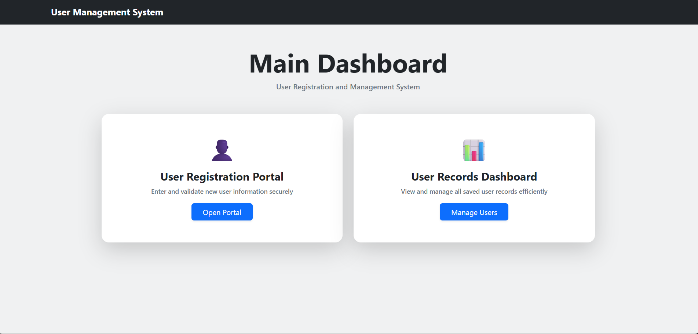
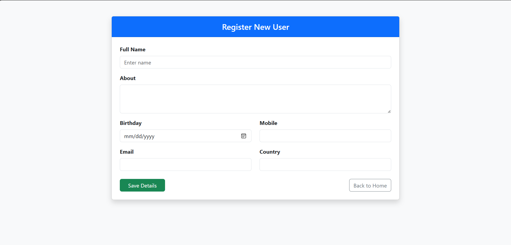
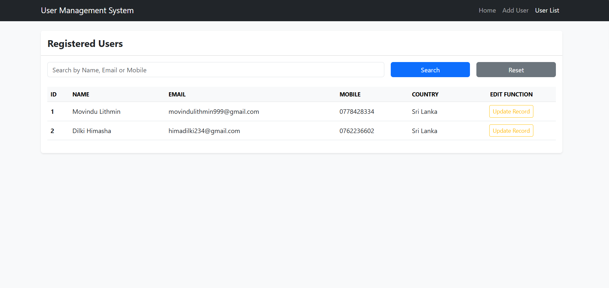
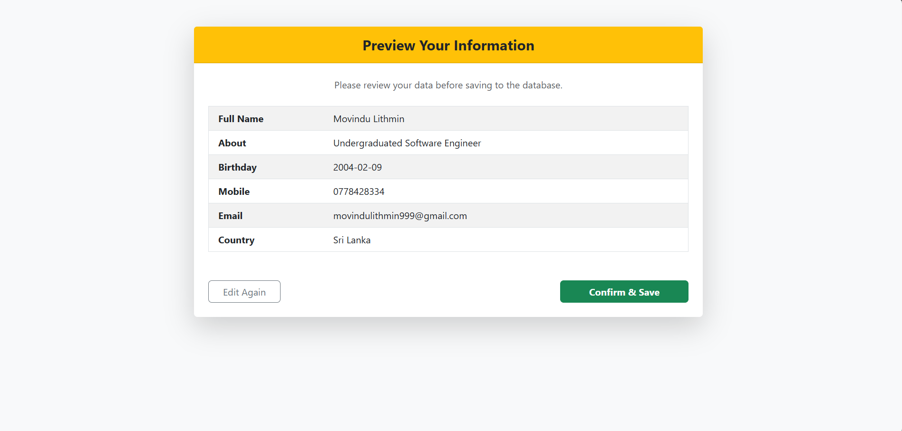
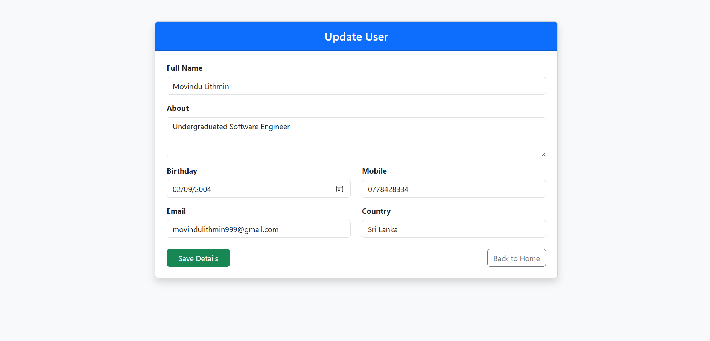

# Software Engineer Internship Assignment (Java)

## 📌 Project Overview
This project is a Java-based web application developed to demonstrate the ability to capture, store, retrieve, and manage user data using a relational database. It serves as a practical implementation of a User Management System with a focus on data integrity and user experience.

### 📋 Main Functionalities:
- **Submit Information:** Capture user details via a validated web form.
- **Preview Before Submit:** Before final registration, users can review entered form data in a preview screen to ensure accuracy before saving to the database.
- **Data Persistence:** Store and manage data permanently in a MySQL database.
- **Dashboard View:** A centralized view to see all saved records.
- **Edit & Update:** Full functionality to modify existing user information.
- **Search & Filter:** Quickly find records by Name, Email, or Mobile number.

---

## 📂 Project Structure

The project follows a standard Maven and Spring Boot folder structure with a layered architecture for better maintainability:

```text
assignment/
├── src/
│   ├── main/
│   │   ├── java/
│   │   │   └── com.intern.assignment/
│   │   │       ├── controller/        
│   │   │       │   └── UserController.java
│   │   │       ├── entity/            
│   │   │       │   └── User.java
│   │   │       ├── repository/        
│   │   │       │   └── UserRepository.java
│   │   │       ├── service/           
│   │   │       │   └── UserService.java
│   │   │       └── AssignmentApplication.java  
│   │   └── resources/
│   │       ├── static/                
│   │       ├── templates/             
│   │       │   ├── index.html         
│   │       │   ├── register.html      
│   │       │   ├── preview.html       
│   │       │   └── list.html          
│   │       └── application.properties 
│
├── database.sql                       
│
├── screenshots/                       
│   
└── README.md               
```

---

## 🛠️ Technologies Used
- **Backend:** Java , Spring Boot
- **Frontend:** Thymeleaf, HTML, JavaScript
- **UI Framework:** Bootstrap  (Responsive Design)
- **Database:** MySQL
- **Build Tool:** Maven

---

## 🚀 SETUP INSTRUCTIONS (IMPORTANT)

If you are running this project on your local machine, please follow these steps carefully to set up the database and environment.

### 1. Database Setup (Using MySQL Workbench)
1. Open **MySQL Workbench**.
2. Create a new database named `info_db` by executing the following command:
   ```sql
   CREATE DATABASE info_db;
   ```
3. Locate the `database.sql` file provided in the project root directory.
4. Open and execute the script inside `database.sql` to create the `users` table and insert sample data.

### 2. Configure Database Credentials (CRITICAL STEP)
Before running the application, you **MUST** update the database connection details to match your local MySQL settings:
1. Open the project in your preferred IDE (IntelliJ IDEA or Eclipse).
2. Navigate to the file: `src/main/resources/application.properties`.
3. Locate the following lines and **change the username and password** to match your local MySQL credentials:

```properties
spring.datasource.url=jdbc:mysql://localhost:3306/info_db
spring.datasource.username=YOUR_MYSQL_USERNAME
spring.datasource.password=YOUR_MYSQL_PASSWORD
```

### 3. Running the Application
1. Clone the repository:
   ```bash
   git clone (https://github.com/Movindu999/user-management-system.git)
   ```
2. Navigate to the project folder and run the application via your IDE or terminal:
   ```bash
   mvn spring-boot:run
   ```
3. Access the application in your browser at: [http://localhost:8080](http://localhost:8080)

---

## ✨ Features & Requirements

- **Form Page:** A clean, user-friendly interface to capture: Full Name, About Section, Birthday, Mobile Number, Email Address, and Country.
- **Validation:** Robust server-side and client-side validation to ensure all required fields are filled and formats (like Email and Mobile) are correct.No duplicate **Email** or **Mobile Number** registration allowed.
  Birthday must be a date in the past or today (Future dates are disabled).
- **Advanced Search:** Integrated Search/Filter functionality on the list page to manage user records.
- **Responsive Design:** Optimized for all screen sizes using modern UI practices and Bootstrap.

---

## Screenshots

### Home Page


### Registration Form


### User List


### Preview Form


### Update Form


*Developed for the Software Engineer Internship Assessment - 2026*